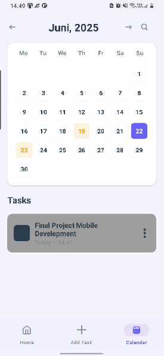

# TaskMaster 📱

## Aplikasi Manajemen Tugas dan Jadwal


<p style="margin-right:10px; flex:0 0 auto; text-align:center" align="center">
    
</p>

**TaskMaster** adalah aplikasi Android native yang dirancang untuk membantu mahasiswa dan profesional mengorganisir dan melacak tugas dengan visualisasi berbasis prioritas dan waktu. Aplikasi ini fokus pada kemudahan penggunaan dan visualisasi yang jelas untuk membantu pengguna mengelola jadwal mereka dengan lebih efektif.

## 🎯 Tujuan dan Manfaat

### Manfaat Utama
- ✅ Membantu pengguna mengorganisir dan memprioritaskan tugas berdasarkan deadline
- 📊 Visualisasi progres tugas untuk meningkatkan motivasi dan produktivitas  
- ⏰ Peringatan otomatis berdasarkan prioritas waktu (sistem warna)
- 🏠 Integrasi dengan widget homescreen untuk akses cepat

### Target Pengguna
- **Mahasiswa (18-25 tahun)**: Mengelola tugas kuliah, jadwal kelas, dan deadline tugas
- **Profesional (25-40 tahun)**: Mengelola jadwal rapat, tenggat proyek, dan aktivitas harian
- **Orang dengan jadwal padat**: Siapapun yang memiliki banyak kegiatan dan membutuhkan alat untuk mengorganisirnya

## 🚀 Fitur Utama

### 1. Home Fragment
- **Monthly Preview**: 4 kotak yang menampilkan ringkasan tugas per bulan (jumlah tugas, distribusi prioritas)
- **Progress Tracker**: Visualisasi tugas yang sedang dikerjakan dengan indikator progress
- **Notifikasi Tugas**: 3 filter (upcoming, in progress, completed)
- **Prioritas Visual**: Sistem warna berdasarkan kedekatan deadline
  - 🔴 Merah: Deadline sangat dekat
  - 🟡 Kuning: 2-3 hari lagi
  - 🟢 Hijau: Seminggu lagi

### 2. Add Task Fragment
- Form pembuatan tugas dengan field lengkap:
  - Nama tugas
  - Tanggal (date picker)
  - Waktu mulai-selesai (time picker)
  - Deskripsi
  - Kategori tugas (dropdown selection)
- Edit mode untuk memodifikasi tugas yang sudah ada
- Prioritas otomatis berdasarkan tanggal yang dipilih

### 3. Calendar Fragment
- Tampilan kalender bulanan dengan indikator tugas
- Tampilan detail tugas harian saat tanggal dipilih
- Fitur pencarian tugas
- Filter berdasarkan kategori tugas
- Visualisasi warna berdasarkan prioritas

### 4. Widget Homescreen
- Menampilkan tugas hari ini
- Indikator prioritas dengan sistem warna
- Quick action untuk menandai tugas selesai
- Shortcut ke aplikasi utama

### 5. Dark/Light Mode
- **Theme Toggle**: Pengguna dapat beralih antara mode terang dan gelap
- **Automatic Theme**: Mengikuti pengaturan sistem device
- **Consistent Design**: Semua komponen UI menyesuaikan dengan theme yang dipilih
- **Eye Comfort**: Mode gelap mengurangi kelelahan mata saat penggunaan di malam hari
- **Battery Optimization**: Mode gelap membantu menghemat battery pada device dengan layar OLED

## 🛠️ Teknologi yang Digunakan

<p align="center">
    
    
    
    
    
    
    
</p>

### Framework & Bahasa

<p align="center">
    
    
    
</p>

- **Platform**: Android Native
- **Bahasa Pemrograman**: Java
- **Minimum SDK**: Android 7.0 (API level 24)
- **Target SDK**: Android 14 (API level 34)

### Library & Dependencies

<p align="center">
    
    
    
    
    
</p>

- **Room Database**: Penyimpanan lokal data tugas dan preferensi
- **Material Design Components**: UI modern dan konsisten
- **RecyclerView dengan DiffUtil**: Menampilkan daftar tugas dengan efisien
- **CalendarView**: Tampilan kalender yang interaktif
- **AppWidgetProvider**: Implementasi widget homescreen
- **SearchView**: Fitur pencarian tugas
- **DateTimePicker**: Pemilihan tanggal dan waktu yang user-friendly
- **WorkManager**: Manajemen notifikasi terjadwal
- **AppCompatDelegate**: Implementasi Dark/Light Mode yang smooth dan responsive

## 🎨 Desain UI/UX

### Skema Warna
- **Warna Primer**: Biru (#2196F3)
- **Warna Aksen**: Oranye (#FF9800)
- **Warna Prioritas**: 
  - Merah (#F44336) - Urgent
  - Kuning (#FFC107) - Medium
  - Hijau (#4CAF50) - Low
- **Font**: Roboto (sesuai standar Material Design)

### Theme Support
- **Light Mode**: Theme terang dengan kontras yang optimal untuk penggunaan siang hari
- **Dark Mode**: Theme gelap yang nyaman untuk mata dan menghemat battery
- **Adaptive Theme**: Otomatis mengikuti pengaturan sistem device
- **Consistent Branding**: Warna primer dan aksen tetap konsisten di kedua theme

### Komponen UI Utama

<div align="center" style="overflow-x:auto;">
    <table style="border:none;">
        <tr style="background:none; border:none;">
            <td align="center" style="border:none; padding:10px;">
                <br>
                <strong>Home Fragment</strong>
            </td>
            <td align="center" style="border:none; padding:10px;">
                <br>
                <strong>Add Task Fragment</strong>
            </td>
            <td align="center" style="border:none; padding:10px;">
                <br>
                <strong>Calendar Fragment</strong>
            </td>
            <td align="center" style="border:none; padding:10px;">
                <br>
                <strong>Search Fragment</strong>
            </td>
        </tr>
    </table>
    <table>
        <tr style="background:none; border:none;">
            <td align="center" style="border:none; padding:10px;">
                <br>
                <strong>Notification Activity</strong>
            </td>
            <td align="center" style="border:none; padding:10px;">
                <br>
                <strong>Detail Task Activity</strong>
            </td>
            <td align="center" style="border:none; padding:10px;">
                <br>
                <strong>Settings Activity</strong>
            </td>
            <td align="center" style="border:none; padding:10px;">
                <br>
                <strong>Widget</strong>
            </td>
        </tr>
    </table>
</div>

## 📋 Permasalahan yang Diselesaikan

TaskMaster dirancang untuk mengatasi tantangan umum dalam manajemen waktu:

1. **Organisasi Tugas**: Membantu pengguna mengorganisir tugas-tugas dengan deadline yang berbeda
2. **Visualisasi Prioritas**: Memvisualisasikan prioritas tugas berdasarkan kedekatan deadline
3. **Akses Cepat**: Menyediakan akses cepat ke informasi jadwal melalui widget homescreen
4. **Tampilan Komprehensif**: Memberikan overview tugas yang akan datang, sedang berlangsung, dan telah selesai

## 💡 Kasus Penggunaan

### Skenario 1: Mahasiswa
Seorang mahasiswa memiliki beberapa tugas dengan deadline berbeda dan ingin melihat secara cepat tugas mana yang harus diselesaikan terlebih dahulu melalui sistem prioritas warna.

### Skenario 2: Profesional
Seorang profesional ingin melihat jadwal rapat dan pekerjaan untuk hari ini di widget homescreen tanpa perlu membuka aplikasi.

### Skenario 3: Pencarian Tugas
Pengguna ingin mencari tugas tertentu dan melihat kapan jadwalnya tanpa harus menggulir kalender.

## 🔄 Alur Penggunaan

1. Pengguna membuka aplikasi dan melihat Home fragment dengan monthly preview
2. Untuk menambah tugas baru, navigasi ke Add Task fragment
3. Mengisi detail tugas (nama, tanggal, waktu, deskripsi, kategori)
4. Sistem otomatis menetapkan warna prioritas berdasarkan deadline
5. Melihat tugas di Calendar fragment dan menggunakan fitur pencarian
6. Menambahkan widget ke homescreen untuk akses cepat
7. Menerima notifikasi sesuai jadwal tugas

## 🏆 Keunggulan Dibanding Kompetitor

### vs Google Calendar
- ✅ Fokus khusus pada manajemen tugas
- ✅ Sistem prioritas visual otomatis
- ✅ Widget yang lebih informatif
- ✅ Dark/Light mode yang lebih responsif

### vs Microsoft To Do
- ✅ Visualisasi yang lebih kaya
- ✅ Pengaturan waktu mulai-selesai yang detail
- ✅ Integrasi kalender yang lebih baik
- ✅ Theme switching yang lebih smooth

### vs Any.do
- ✅ Sistem prioritas otomatis berbasis warna
- ✅ Widget homescreen yang lebih informatif
- ✅ Filter tugas yang lebih intuitif
- ✅ Dukungan dark mode yang konsisten di seluruh aplikasi

## 📊 Statistik & Data Pendukung

- 87% mahasiswa mengalami stres akibat manajemen waktu yang buruk
- Visualisasi prioritas berbasis warna membantu otak memproses informasi lebih cepat dan intuitif
- Integrasi kalender dan widget memudahkan akses instan ke informasi jadwal penting

## 🚀 Instalasi dan Setup

### Prasyarat
- Android Studio Arctic Fox atau lebih baru
- JDK 8 atau lebih tinggi
- Android SDK dengan minimum API level 24

### Langkah Instalasi
1. Clone repository ini:
   ```bash
   git clone [repository-url]
   ```

2. Buka project di Android Studio

3. Sync project dengan Gradle files

4. Build dan run aplikasi pada device atau emulator

### Build APK
```bash
./gradlew assembleDebug
```

## 📁 Struktur Project

```
TaskMaster/
├── app/
│   ├── src/
│   │   ├── main/
│   │   │   ├── java/
│   │   │   │   └── [package]/
│   │   │   │       ├── fragments/
│   │   │   │       ├── activities/
│   │   │   │       ├── adapters/
│   │   │   │       ├── database/
│   │   │   │       ├── models/
│   │   │   │       └── utils/
│   │   │   └── res/
│   │   │       ├── layout/
│   │   │       ├── values/
│   │   │       └── drawable/
│   │   ├── androidTest/
│   │   └── test/
│   └── build.gradle.kts
├── gradle/
├── build.gradle.kts
└── README.md
```

## 🤝 Kontribusi

Kami menyambut kontribusi untuk pengembangan TaskMaster! Silakan:

1. Fork repository ini
2. Buat branch fitur baru (`git checkout -b feature/AmazingFeature`)
3. Commit perubahan (`git commit -m 'Add some AmazingFeature'`)
4. Push ke branch (`git push origin feature/AmazingFeature`)
5. Buat Pull Request

## 👥 Tim Pengembang

- Rezka Wildan Nurhadi Bakri 
- Restu Ahmadinata
- Cholyn Sharon Enos
- Dhian Alifka Azzahra
- A. Syaifullah Aksa

---

**TaskMaster** - Organize your tasks, master your time! ⏰✨
